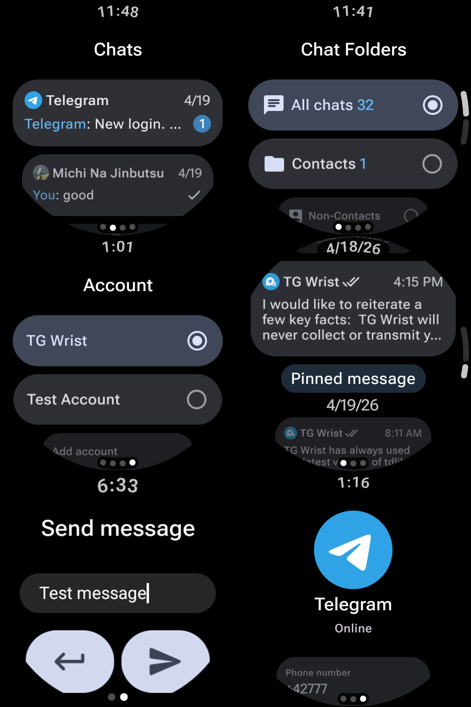

<a href="https://github.com/TGWrist/TGWrist">

</a>

<div align="center">
  <br/>
  <div>
      <a href="./README.md">English</a> | 简体中文 | <a href="./README.zh-TW.md">繁體中文</a> | <a href="./README.ja-JP.md">日本語</a> | <a href="./README.ru-RU.md">Русский</a>
  </div>
  <br/>

<div>
    <a href="https://github.com/TGWrist/TGWrist/releases">
        
    </a >
    <a href="https://github.com/MShawon/github-clone-count-badge">
        
    </a >
    <a href="https://play.google.com/store/apps/details?id=com.tgwrist.app">
      
    </a >
  </div>
</div>



## 下载

我们推荐从 Google Play 下载 TG Wrist：

[在 Google Play 下载](https://play.google.com/store/apps/details?id=com.tgwrist.app)

Google Play 会提供最适合你设备的版本，通常下载体积也更小。它还能让安装和后续更新更轻松，无需手动使用 ADB 安装。

### ADB 安装

> 不建议大多数用户使用。  
> 请尽可能从 Google Play 安装。

如果你仍想手动安装 APK：

1. 从 GitHub Releases 下载 APK。如果提供了多个 APK，请选择与你手表架构匹配的版本，例如 `full`、`arm32` 或 `arm64`。
2. 使用 ADB 安装：

```shell
adb install TGWrist.apk
```

## 功能

- 无需依赖手机，可在 Wear OS 手表上独立运行
- 浏览全部聊天、归档聊天和聊天文件夹，支持未读数量、聊天头像、在线/成员信息更新和滚动位置保持
- 查看消息历史，支持未读消息定位、跳转最新消息、正在输入/上传/录制等会话动作状态，以及更可靠的分页加载
- 通过 FCM 接收 Telegram 通知，支持消息通知分组、稳定跳转到对应聊天、通知内标记已读和快捷回复
- 直接从手表发送文本消息、语音消息，以及图片或视频消息；选择多个媒体时可发送媒体相册
- 在手表上管理账号，支持添加账号、退出登录和删除本地账号数据
- 长按消息进入选择模式，支持单选或多选、取消已选回复/转发目标，并避免重复加入转发消息
- 支持消息回复、在支持的消息类型上编辑文本或说明文字、用选中的图片或视频替换可编辑媒体，以及在 Telegram 允许时为自己或所有人删除消息
- 支持单条/多条消息转发，可在支持时隐藏发送者名称或移除说明文字
- 支持打开 `tg://`、公开聊天、消息链接、机器人启动链接和邀请链接等 Telegram 链接，并可预览邀请信息、直接在手表上加入群组或频道
- 支持 Telegram VoIP 通话，可拨打和接听电话，并提供来电通知、通话状态更新和音频输出切换
- 可在消息详情中预览、下载、用外部应用打开、播放和保存支持的媒体内容，支持内置视频播放，音频文件、语音消息和语音录制预览支持点击或拖动进度
- 可查看消息发送者、回复目标、话题、置顶状态、查看/转发次数、表情回应、翻译结果，以及可选择或复制的富文本内容
- 支持位置消息，显示经纬度、精度、实时位置字段，可复制坐标并打开地图
- 支持查看和参与投票/测验，包括单选、多选、结果展示、测验解释、允许时撤回投票，以及停止可编辑投票
- 支持在设置中管理存储，可查看并清理照片、临时文件、文档、缩略图、语音消息和视频等目录
- 当前支持渲染的消息类型包括文本、图片、视频、文档、GIF/动画、动画表情、贴纸、语音消息、圆形视频消息、音频文件、位置、实时位置、投票、测验、通话记录和多种 Telegram 服务消息
- 支持在登录和设置中管理网络连接，可使用直连、SOCKS5、HTTP 和 MTProto 代理；代理列表会持久保存，并在账号或 TDLib 重启后自动重新应用
- 支持聊天列表、消息历史、消息预览、媒体相册、消息交互信息更新、被裁剪消息的微光占位加载，以及适配低内存设备的聊天消息缓存

## 设计细节

- 专为 Wear OS 手表设计
- 针对小型圆形屏幕精心优化
- 使用适配 Wear OS 设备的布局
- 使用 Material Design 3 / Wear OS 风格界面
- 平滑滚动和响应式交互

## 隐私与透明度

- 使用 Android Keystore / TEE 保护敏感的本地账号数据
- 将账号数据存储在应用私有的本地存储中
- 退出登录后删除本地账号数据
- 允许用户控制是否启用 FCM 等 Google 相关服务
- 开源代码，用于透明化和公开审查

## 社区

我们推荐使用 [issue](https://github.com/TGWrist/TGWrist/issues) 提供最直接、
有效的反馈。当然，也可以通过以下方式反馈：

- [Telegram Channel](https://t.me/tgwrist)
- [Telegram Group](https://t.me/TGwristChat)

## 许可证

本项目代码可公开查看，但不是开源软件。

源代码仅为透明度、安全审查和公开检查而公开。未经明确书面许可，
不得复制、复用、修改、再分发或基于此代码创建衍生作品。

## Star History

<a href="https://star-history.com/#TGWrist/TGWrist&Date">
 <picture>
   <source media="(prefers-color-scheme: dark)" srcset="https://api.star-history.com/svg?repos=TGWrist/TGWrist&type=Date&theme=dark" />
   <source media="(prefers-color-scheme: light)" srcset="https://api.star-history.com/svg?repos=TGWrist/TGWrist&type=Date" />
   
 </picture>
</a>
